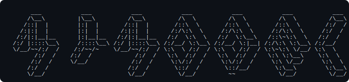

<div align="center">

<picture>
  <source media="(prefers-color-scheme: dark)" srcset="logo.svg">
  <source media="(prefers-color-scheme: light)" srcset="logo.svg">
  
</picture>

# MyModel

**Create your own AI model in 5 minutes.**

One YAML file. Any provider. Text, images, audio — all through a single endpoint.

[](LICENSE)
[](https://go.dev)
[](src/mymodel-cli-ts)
[](https://platform.openai.com/docs/api-reference)

</div>

---

## What is MyModel?

MyModel wraps **any LLM provider** into a single OpenAI-compatible API. You write a config, MyModel handles everything else: routing, multimodal detection, model selection.

Works with **Regolo, OpenAI, Anthropic, Google Gemini, xAI Grok, Groq, Together, Fireworks, Ollama, local vLLM** — anything that speaks OpenAI format.

```
                                           ┌─ claude-opus-4-6 (complex reasoning)
Your app ──> MyModel ──> yourmodel ────────┼─ gpt-5-codex (coding)
             :8000       (auto-routes)     ├─ qwen3.5-122b (images + OCR)
                                           └─ faster-whisper (audio)
```

- **Text** routes to the best model based on content (keywords, domains, complexity)
- **Images** go to a vision model automatically
- **Audio** gets transcribed then routed as text
- **Any OpenAI SDK** works — no client changes needed

---

## Solved Problems

### 🔌 Your app talks to one endpoint, not five

Without MyModel, your code juggles multiple SDKs, API keys, and endpoints. A coding question goes to one API, a vision request to another, audio to a third. Every new model means new integration code.

With MyModel: **one base URL, one `model: "yourmodelname"`, one SDK**. Your app never changes, even when you swap backends.

### 👁️ Any model becomes multimodal

Most LLMs are text-only. With MyModel, you can send images and audio to a text model — your model automatically runs OCR or speech-to-text first, then routes the extracted text through your pipeline. A model like `llama-3.3-70b` that has zero vision capability can now "see" documents and "hear" audio, because MyModel preprocesses the input before it reaches the model.

### 💰 Smart routing cuts cost without cutting quality

Instead of sending everything to the most expensive model, MyModel routes based on content. Simple greetings go to a fast, cheap model. Complex reasoning goes to a premium one. Coding questions go to a code-specialized model. You define the rules in YAML — no code changes needed.

### 🛡️ Built-in security

Jailbreak detection runs on every request before it reaches any model. A local ML classifier (no external API calls) flags prompt injection attempts and blocks them with a `content_filter` response. PII detection can catch personal information before it leaves your infrastructure. All configurable, all optional.

### ⚡ Semantic caching saves money

When two users ask nearly the same question, MyModel can return the cached response instead of calling the LLM again. The cache uses vector similarity (not exact match), so "What's the capital of France?" and "Tell me France's capital" hit the same cache entry.

### 🔄 Zero vendor lock-in

Switch from OpenAI to Anthropic to Groq to a local Ollama server — just change the `provider` and `model` in your YAML. Your application code stays identical. You can even run multiple providers simultaneously and route between them.

### ✨ Less code, more resilience

No more try/catch chains across provider SDKs, no more if/else for modality detection, no more manual model selection logic. MyModel replaces hundreds of lines of routing code with a 20-line YAML file. If a provider goes down, change one line and restart — your app never knows the difference.

---

## Quick Start

### 1. Write a config

```yaml
model:
  name: my-assistant

providers:
  anthropic:
    type: anthropic
    base_url: https://api.anthropic.com
    api_key: ${ANTHROPIC_API_KEY}
  openai:
    type: openai-compatible
    base_url: https://api.openai.com/v1
    api_key: ${OPENAI_API_KEY}
  regoloai:
    type: openai-compatible
    base_url: https://api.regolo.ai/v1
    api_key: ${REGOLO_API_KEY}

text_routes:
  - name: reasoning
    provider: anthropic
    model: claude-opus-4-6
    priority: 80
    operator: OR
    signals:
      keywords: [explain, analyze, compare, why, reason, think]

  - name: coding
    provider: openai
    model: gpt-5-codex
    priority: 70
    operator: OR
    signals:
      keywords: [code, python, javascript, debug, function, algorithm]
      domains: [computer_science]

  - name: default
    provider: regoloai
    model: gpt-oss-120b
    priority: 0
    operator: OR

modality_routes:
  multimodal:
    provider: regoloai
    model: qwen3.5-122b
  image:
    provider: regoloai
    model: qwen3.5-122b
  audio:
    provider: regoloai
    model: faster-whisper-large-v3

server_port: 8000
```

Three providers, one endpoint. Complex reasoning goes to Claude Opus, coding to GPT-5 Codex, everything else to Regolo's open-source model. Images and OCR go to Qwen 3.5 122B, audio gets transcribed by Whisper.

### 2. Build & run

```bash
docker build -t mymodel:latest .

export OPENAI_API_KEY="sk-..."

docker run -d --name mymodel -p 8000:8000 \
  -v $(pwd)/config.yaml:/app/config/config.yaml:ro \
  -e OPENAI_API_KEY \
  mymodel:latest --config /app/config/config.yaml --port 8000
```

### 3. Call it

```bash
curl http://localhost:8000/v1/chat/completions \
  -H "Content-Type: application/json" \
  -H "Authorization: Bearer $OPENAI_API_KEY" \
  -d '{"model": "my-assistant", "messages": [{"role": "user", "content": "Hello!"}]}'
```

Or with the Python SDK:

```python
from openai import OpenAI

client = OpenAI(base_url="http://localhost:8000/v1", api_key="your-key")
r = client.chat.completions.create(
    model="my-assistant",
    messages=[{"role": "user", "content": "Explain quantum computing simply"}]
)
print(r.choices[0].message.content)
```

---

## Providers

MyModel works with any OpenAI-compatible API. Here are some examples:

### Regolo AI

```yaml
providers:
  regoloai:
    type: openai-compatible
    base_url: https://api.regolo.ai/v1
    api_key: ${REGOLO_API_KEY}
text_routes:
  - name: default
    provider: regoloai
    model: gpt-oss-120b
    priority: 0
    operator: OR
modality_routes:
  audio:
    provider: regoloai
    model: faster-whisper-large-v3
  image:
    provider: regoloai
    model: qwen3.5-122b
  multimodal:
    provider: regoloai
    model: qwen3.5-122b
```

### OpenAI

```yaml
providers:
  openai:
    type: openai-compatible
    base_url: https://api.openai.com/v1
    api_key: ${OPENAI_API_KEY}
text_routes:
  - name: default
    provider: openai
    model: gpt-5
    priority: 0
    operator: OR
modality_routes:
  multimodal:
    provider: openai
    model: gpt-5
```

### Anthropic

```yaml
providers:
  anthropic:
    type: anthropic
    base_url: https://api.anthropic.com
    api_key: ${ANTHROPIC_API_KEY}
text_routes:
  - name: default
    provider: anthropic
    model: claude-opus-4-6
    priority: 0
    operator: OR
```

### Google Gemini

```yaml
providers:
  gemini:
    type: openai-compatible
    base_url: https://generativelanguage.googleapis.com/v1beta/openai
    api_key: ${GEMINI_API_KEY}
text_routes:
  - name: default
    provider: gemini
    model: gemini-2.5-pro
    priority: 0
    operator: OR
modality_routes:
  multimodal:
    provider: gemini
    model: gemini-2.5-pro
```

### xAI Grok

```yaml
providers:
  xai:
    type: openai-compatible
    base_url: https://api.x.ai/v1
    api_key: ${XAI_API_KEY}
text_routes:
  - name: default
    provider: xai
    model: grok-3
    priority: 0
    operator: OR
modality_routes:
  multimodal:
    provider: xai
    model: grok-3
```

### Groq (fast inference)

```yaml
providers:
  groq:
    type: openai-compatible
    base_url: https://api.groq.com/openai/v1
    api_key: ${GROQ_API_KEY}
text_routes:
  - name: default
    provider: groq
    model: llama-3.3-70b-versatile
    priority: 0
    operator: OR
```

### Together AI

```yaml
providers:
  together:
    type: openai-compatible
    base_url: https://api.together.xyz/v1
    api_key: ${TOGETHER_API_KEY}
text_routes:
  - name: default
    provider: together
    model: meta-llama/Llama-3.3-70B-Instruct-Turbo
    priority: 0
    operator: OR
```

### Fireworks AI

```yaml
providers:
  fireworks:
    type: openai-compatible
    base_url: https://api.fireworks.ai/inference/v1
    api_key: ${FIREWORKS_API_KEY}
text_routes:
  - name: default
    provider: fireworks
    model: accounts/fireworks/models/llama-v3p3-70b-instruct
    priority: 0
    operator: OR
```

### Ollama (local)

```yaml
providers:
  local:
    type: openai-compatible
    base_url: http://localhost:11434/v1
    api_key: ollama
text_routes:
  - name: default
    provider: local
    model: llama3.1
    priority: 0
    operator: OR
```

### Mix multiple providers

The real power: route different types of requests to different providers.

```yaml
providers:
  fast:
    type: openai-compatible
    base_url: https://api.groq.com/openai/v1
    api_key: ${GROQ_API_KEY}
  smart:
    type: openai-compatible
    base_url: https://api.openai.com/v1
    api_key: ${OPENAI_API_KEY}
  vision:
    type: openai-compatible
    base_url: https://api.openai.com/v1
    api_key: ${OPENAI_API_KEY}

text_routes:
  - name: coding
    provider: smart
    model: gpt-5-codex
    priority: 80
    operator: OR
    signals:
      keywords: [code, debug, function, class, algorithm, python, javascript]
      domains: [computer_science]

  - name: default
    provider: fast
    model: llama-3.3-70b-versatile
    priority: 0
    operator: OR

modality_routes:
  multimodal:
    provider: vision
    model: gpt-5
```

This sends coding questions to GPT-5 Codex, everything else to Llama on Groq (fast and cheap), and images to GPT-5 vision.

---

## How your model handles multimodal input

Every request goes to `model: "your-model-name"` — the name you chose in `model.name`. MyModel detects what you're sending and routes it automatically:

| What you send | What MyModel does | Where it goes |
|---|---|---|
| **Text** | Routes through semantic pipeline | Best matching text model |
| **Image + text** | Forwards with image intact | Vision model (`modality_routes.multimodal`) |
| **Image only** | Runs OCR, then routes extracted text | OCR model → text pipeline |
| **Audio** | Transcribes, then routes text | STT model → text pipeline |
| **Audio + image** | OCR + STT in parallel, routes combined text | Both → text pipeline |

You never need to detect modality or pick models. Your model does it for you.

### Direct model access

Already know which model you want? Bypass routing:

```bash
curl http://localhost:8000/v1/chat/completions \
  -H "x-selected-model: gpt-5" \
  -H "Authorization: Bearer $OPENAI_API_KEY" \
  -d '{"model": "my-assistant", "messages": [{"role": "user", "content": "Hi"}]}'
```

---

## Semantic text routing

Route different questions to different models based on content:

```yaml
text_routes:
  - name: coding
    provider: smart
    model: gpt-5-codex
    priority: 80
    operator: OR
    signals:
      keywords: [code, python, javascript, debug, algorithm, function, class]
      domains: [computer_science]

  - name: math
    provider: smart
    model: claude-opus-4-6
    priority: 70
    operator: OR
    signals:
      keywords: [calculate, equation, proof, theorem, integral, derivative]
      domains: [mathematics]

  - name: default
    provider: fast
    model: llama-3.3-70b-versatile
    priority: 0
    operator: OR
```

- **Priority**: higher = evaluated first (0-100)
- **Operator**: `OR` = any signal matches, `AND` = all must match
- **Keywords**: case-insensitive word matching
- **Domains**: ML-based classification into academic categories

**Available domains**: `computer_science`, `mathematics`, `physics`, `biology`, `chemistry`, `business`, `economics`, `philosophy`, `law`, `history`, `psychology`, `health`, `engineering`, `other`

---

## Configuration reference

Full list of every parameter in `config.yaml`.

### `model`

Your model's identity. This is what you see in logs and in the `/v1/models` endpoint.

| Parameter | Type | Required | Default | Description |
|---|---|---|---|---|
| `model.name` | string | yes | `"MyModel"` | The name of your model. Can be anything — it's just a label. |
| `model.description` | string | no | `""` | Optional description for your reference. |

```yaml
model:
  name: zeus
  description: "Multi-provider AI assistant with vision and audio"
```

### `providers`

The LLM backends your model connects to. You can define as many as you want and reference them in routes by name.

| Parameter | Type | Required | Description |
|---|---|---|---|
| `providers.<name>` | object | yes (at least one) | A named provider. The name is your choice (e.g., `openai`, `fast`, `my-local-server`). |
| `providers.<name>.type` | string | yes | `"openai-compatible"` for any OpenAI-format API (OpenAI, Groq, Together, Gemini, Grok, Regolo, Ollama, vLLM, etc.). `"anthropic"` for Anthropic's native API format. |
| `providers.<name>.base_url` | string | yes | The API base URL. Must end with `/v1` for OpenAI-compatible providers. Examples: `https://api.openai.com/v1`, `https://api.x.ai/v1`, `http://localhost:11434/v1`. |
| `providers.<name>.api_key` | string | yes | API key. Use `${ENV_VAR_NAME}` syntax to reference environment variables instead of hardcoding secrets. |

```yaml
providers:
  anthropic:
    type: anthropic
    base_url: https://api.anthropic.com
    api_key: ${ANTHROPIC_API_KEY}
  openai:
    type: openai-compatible
    base_url: https://api.openai.com/v1
    api_key: ${OPENAI_API_KEY}
  local:
    type: openai-compatible
    base_url: http://localhost:11434/v1
    api_key: ollama              # Ollama doesn't need a real key
```

### `text_routes`

Rules that determine which model handles each text request. Routes are evaluated by priority (highest first). The first matching route wins. A route with no `signals` acts as the default fallback.

| Parameter | Type | Required | Default | Description |
|---|---|---|---|---|
| `text_routes[].name` | string | yes | — | Unique name for the route (e.g., `"coding"`, `"math"`, `"default"`). Used in logs and routing decisions. |
| `text_routes[].provider` | string | yes | — | Name of the provider to use (must match a key in `providers`). |
| `text_routes[].model` | string | yes | — | Model ID as the provider knows it (e.g., `"gpt-5"`, `"claude-opus-4-6"`, `"llama3.1"`). |
| `text_routes[].priority` | integer | no | `50` | Evaluation order: 0–100, higher = evaluated first. Use 0 for the default/fallback route. |
| `text_routes[].operator` | string | no | `"OR"` | How to combine signals: `"OR"` = any signal match triggers the route, `"AND"` = all signals must match. |
| `text_routes[].signals` | object | no | — | Matching criteria. Omit entirely for the default route (matches everything). |
| `text_routes[].signals.keywords` | string[] | no | `[]` | List of keywords to match in the user's message. Case-insensitive. Example: `[code, python, debug]`. |
| `text_routes[].signals.domains` | string[] | no | `[]` | Academic domains for ML-based classification. The router uses an embedded BERT model to classify the message into these categories. |

**Available domains**: `computer_science`, `mathematics`, `physics`, `biology`, `chemistry`, `business`, `economics`, `philosophy`, `law`, `history`, `psychology`, `health`, `engineering`, `other`

```yaml
text_routes:
  # High priority: coding questions → GPT-5 Codex
  - name: coding
    provider: openai
    model: gpt-5-codex
    priority: 80
    operator: OR
    signals:
      keywords: [code, python, javascript, debug, function, algorithm, class, refactor]
      domains: [computer_science]

  # Medium priority: math → Claude Opus
  - name: math
    provider: anthropic
    model: claude-opus-4-6
    priority: 70
    operator: AND                # Both keyword AND domain must match
    signals:
      keywords: [calculate, equation, proof, theorem]
      domains: [mathematics]

  # Fallback: everything else → fast cheap model
  - name: default
    provider: groq
    model: llama-3.3-70b-versatile
    priority: 0
    operator: OR
    # No signals = catches everything that didn't match above
```

### `modality_routes`

Models for non-text content. When your model receives an image or audio, these routes determine which backend handles it. All three are optional — add only the modalities you need.

| Parameter | Type | Required | Description |
|---|---|---|---|
| `modality_routes.multimodal` | object | no | Handles **image + text** requests. The model must support `image_url` content parts (vision models). The original image is forwarded intact. |
| `modality_routes.multimodal.provider` | string | yes | Provider name from `providers`. |
| `modality_routes.multimodal.model` | string | yes | Vision model ID (e.g., `gpt-5`, `gemini-2.5-pro`, `qwen3.5-122b`). |
| `modality_routes.image` | object | no | Handles **image-only** requests (no text). Used for OCR: extracts text from the image, then routes the extracted text through `text_routes`. |
| `modality_routes.image.provider` | string | yes | Provider name from `providers`. |
| `modality_routes.image.model` | string | yes | OCR/vision model ID. |
| `modality_routes.audio` | object | no | Handles **audio** content. Transcribes audio via a Whisper-compatible STT endpoint, then routes the transcribed text through `text_routes`. |
| `modality_routes.audio.provider` | string | yes | Provider name from `providers`. |
| `modality_routes.audio.model` | string | yes | STT model ID (e.g., `faster-whisper-large-v3`, `whisper-1`). |

```yaml
modality_routes:
  multimodal:                   # "What's in this image?" + image → vision model
    provider: openai
    model: gpt-5
  image:                        # Image only (no text) → OCR → text pipeline
    provider: regoloai
    model: qwen3.5-122b
  audio:                        # Audio → transcription → text pipeline
    provider: regoloai
    model: faster-whisper-large-v3
```

### `plugins`

Optional features that run on every request before routing.

| Parameter | Type | Default | Description |
|---|---|---|---|
| `plugins.semantic_cache.enabled` | boolean | `false` | When `true`, caches responses for semantically similar requests. Reduces latency and cost for repeated questions. Uses an embedded BERT model to compute similarity. |
| `plugins.jailbreak_guard.enabled` | boolean | `false` | When `true`, runs a jailbreak detection classifier on every request. Blocks requests flagged as jailbreak attempts with a `content_filter` response. |
| `plugins.pii_detection.enabled` | boolean | `false` | When `true`, scans requests for personally identifiable information (names, emails, phone numbers, etc.). |

```yaml
plugins:
  semantic_cache:
    enabled: true
  jailbreak_guard:
    enabled: true
  pii_detection:
    enabled: false
```

### `server_port`

The port the API listens on inside the Docker container.

| Parameter | Type | Default | Description |
|---|---|---|---|
| `server_port` | integer | `8000` | HTTP port for `/v1/chat/completions` and all other endpoints. Must match the `-p` flag in `docker run`. |

```yaml
server_port: 8000
```

---

## API endpoints

| Endpoint | Method | Description |
|---|---|---|
| `/v1/chat/completions` | POST | Chat completions (main endpoint) |
| `/v1/models` | GET | List available models |
| `/health` | GET | Health check |
| `/v1/routing/test` | POST | Test a routing decision |

Standard OpenAI format. Works with any SDK or tool that supports OpenAI.

---

## TypeScript CLI

Interactive setup and server management:

```bash
cd src/mymodel-cli-ts
npm install && npm run build

npx mymodel init          # Guided config wizard
npx mymodel serve         # Start the server
npx mymodel status        # Check health
npx mymodel route "..."   # Test routing offline
npx mymodel config show   # Display current config
```

---

## Architecture

```
 config.yaml (you write this)
      |
      v
 Config Translator (TypeScript)
      |
      v
 Go HTTP Proxy (single binary, port 8000)
      |
      +-- has image/audio?
      |     |
      |    YES ── Multimodal Handler
      |     |       |
      |     |      detect modality
      |     |       |
      |     |      image+text ──> vision model (direct forward)
      |     |      audio ──────> STT ──> text pipeline
      |     |      text ───────> text pipeline
      |     |
      |    NO ── direct forward to specified model
      |
      v
 Text Routing Pipeline
      |
      +-- keyword matching
      +-- domain classification
      +-- priority evaluation
      |
      v
 Selected Backend (OpenAI, Anthropic, Groq, Ollama, ...)
```

---

## Building from source

```bash
# Docker image (includes Rust ML libs + Go binary)
docker build -t mymodel:latest .

# CLI only
cd src/mymodel-cli-ts && npm install && npm run build
```

The Docker build is multi-stage: Rust (ML embeddings) → Go (proxy + router) → Debian slim runtime. Takes ~10 min first time, cached after that.

---

## Attribution

Built on [vLLM Semantic Router](https://github.com/vllm-project/semantic-router) (Apache 2.0). This project adds the Go HTTP proxy, multimodal gateway, TypeScript CLI, and config translator.

## License

Apache License 2.0 — see [LICENSE](LICENSE).
